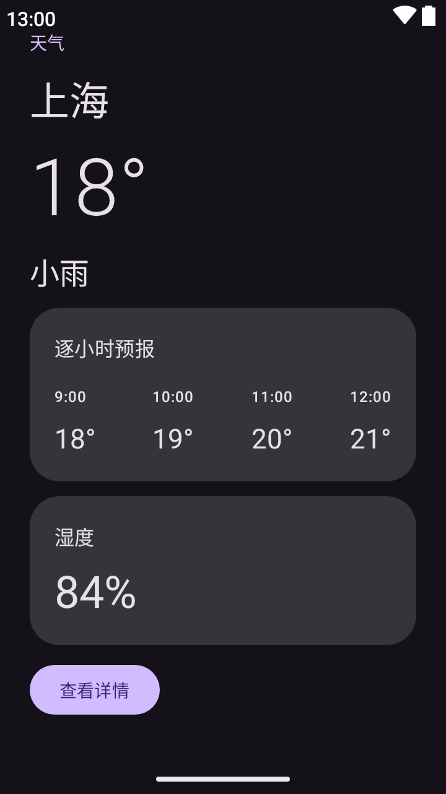
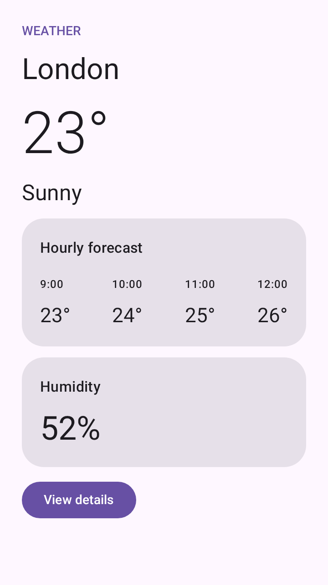
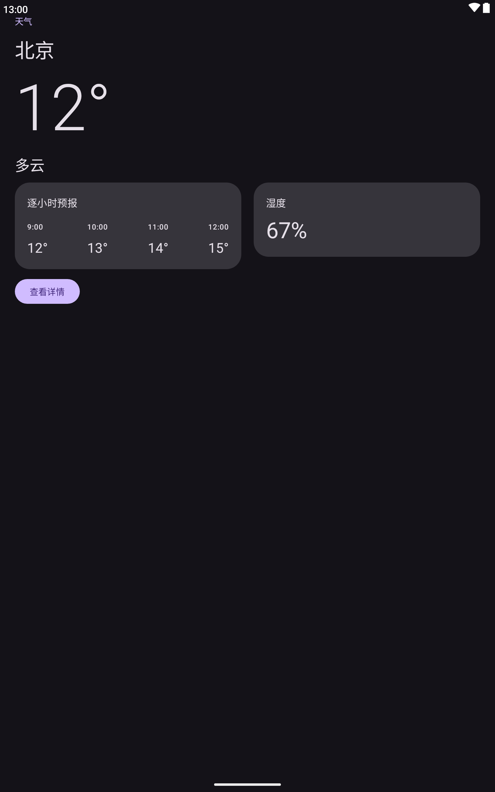

# Verified Screenshots

Real PNGs rendered from the [Compose demo](../compose-demo) using Google's Compose Preview Screenshot Testing alpha16 and Layoutlib. The original files retain their native pixel dimensions, with no resizing or redrawing.

## Gallery

| Dark Phone | Light Phone | Dark Tablet |
| --- | --- | --- |
|  |  |  |
| 720 × 1280 · Chinese | 720 × 1280 · English | 1600 × 2560 · Chinese |
| Shanghai · Rain · 18°C · 84% humidity | London · Sunny · 23°C · 52% humidity | Beijing · Cloudy · 12°C · 67% humidity |
| System bars shown | System bars hidden | System bars shown · Two-column layout |

## Try It

With the skill installed, open the [Compose demo](../compose-demo) and ask your agent:

```text
Use code-to-screenshot to render the Compose demo with
examples/verified/request.json and assets/CaptureScene.kt.
Save the results to a new output folder and verify all three PNGs.
```

See [installation and usage](../../README.md) to get started.

## Verification

All three PNGs passed integrity, exact pixel dimension, and SHA-256 checks. Native status and navigation bars were visually confirmed on the dark phone and tablet renders using the bundled alpha16 compatibility adapter.

**Verified environment:** Windows · JDK 21 · AGP 9.4 · Gradle 9.6 · Android SDK 37.1. AGP 9.5 native test suites have not been fully verified with a render.

- [Capture request](request.json): scene settings and mock data.
- [Capture results](result.json): original image hashes, dimensions, and settings, with paths relative to this directory.
- [Renderer compatibility](../../references/layoutlib.md): setup details and limitations.
